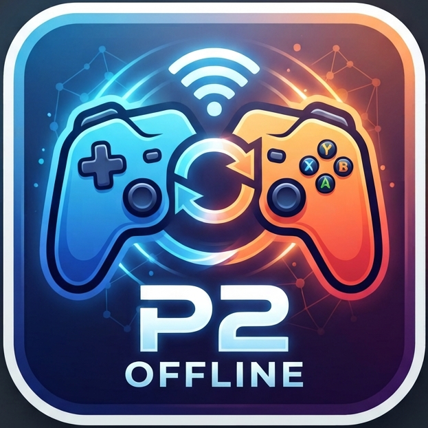
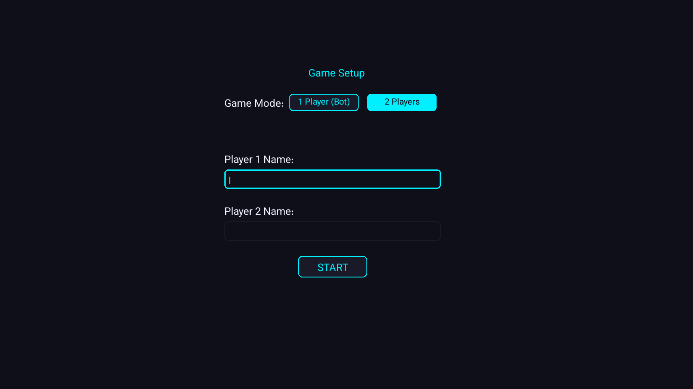
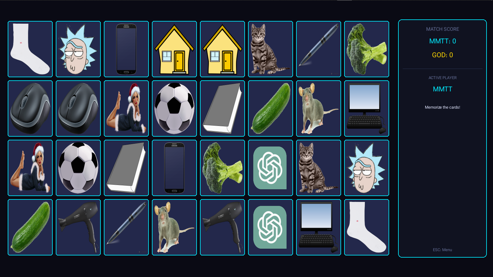
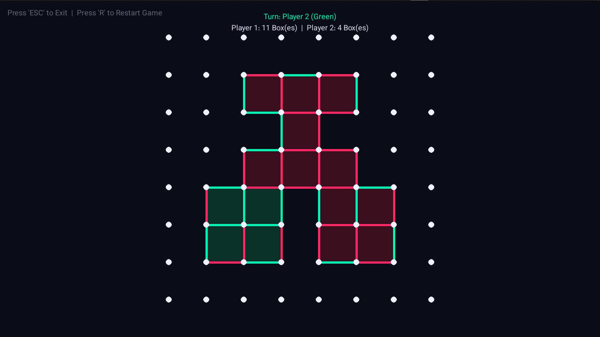
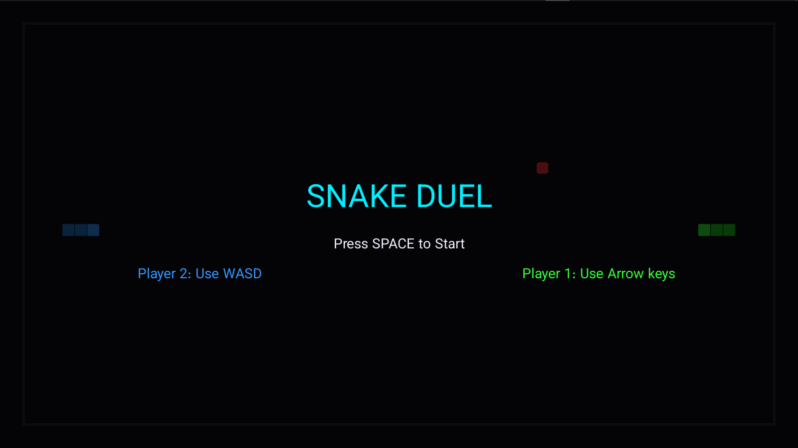

<p align="center">
  
</p>

# 🎮 Python Offline Arcade


A beautifully designed collection of classic offline multiplayer games built with Python and Pygame. Featuring a unified cyberpunk/neon theme, this arcade brings your favorite tabletop and logic games to your screen.

## ✨ Features
* **Unified UI/UX:** A sleek arcade menu to select and launch games seamlessly.
* **Local Multiplayer:** Grab a friend and play together on the same keyboard/screen.
* **Persian Language Support:** Custom utility rendering for right-to-left fonts.
* **Single-Player AI:** Challenge intelligent bots in Chess, Tic-Tac-Toe, Dots and Boxes, Snake Duel, and Backgammon.
* **Current Games Included:**
  * ♔♕♖♗♘♙ Chess
  * ⚅🎲 Backgammon
  * ❌🟢 Tic-Tac-Toe
  * 🐍 Snake Duel
  * 💣💥 Minesweeper
  * 🐉🎲➡⬆ Snakes and Ladders
  * •🖊️▀▄▀▄▀▄ Dots and Boxes 
  * 🎴🤔❓ Memory Cards
  * 🚢 Battleship

## 📸 Game Previews

| Player Registration | Memory Cards |
| :---: | :---: |
|  |  |
| **Dots and Boxes** | **Snake Duel** |
|  |  |

## 🤖 AI Implementation
I have implemented intelligent, custom-built AI agents for several major games to provide a challenging single-player experience. Each AI is tailored to the specific rules and tactical depth of the game:

* **Chess:** Implemented using a **Greedy Material Evaluation Heuristic**. The bot leverages the `python-chess` framework to scan all `legal_moves`, simulates potential captures, and scores them based on standard chess weights (Pawn: 1, Knight/Bishop: 3, Rook: 5, Queen: 9) to execute the highest-value tactical move.
* **Backgammon:** Features a **Rule-Based Heuristic Agent** designed around standard backgammon probabilities and risk management:
    * **Valid Move Evaluation:** Automatically calculates all combinations of available dice rolls.
    * **Strategic Priority:** Prioritizes hitting opponent blots (exposed checkers), creating secure blocks (anchors) with two or more checkers, and moving vulnerable home-board pieces to safety.
    * **Bearing Off:** Optimizes efficiency during the final phase to bear off checkers as quickly as possible.
* **Snake Duel:** Utilizes a multi-layered pathfinding and survival process:
    * **BFS (Breadth-First Search):** Calculates the absolute shortest path to food items.
    * **Flood Fill Algorithm:** Acts as a vital survival mechanism, performing real-time spatial analysis of the remaining grid to avoid trapping itself in "dead ends."
* **Dots and Boxes:** Employs a strategic priority-based agent:
    * **Capture Optimization:** Prioritizes lines that immediately complete a box for scoring.
    * **Chain Control:** Evaluates potential board outcomes to avoid creating the 3rd edge of any box, preventing the opponent from capturing multiple boxes in a chain.
* **Tic-Tac-Toe:** Utilizes the **Minimax algorithm** to ensure perfect play, making the AI unbeatable in this mode.

## 📂 Project Architecture
<details>
<summary><b>Click to expand full Directory Tree</b></summary>

```text
Offline_Games/
│   base_game.py                      # Base class for game structure blueprint
│   main.py                           # Main application entry point & Arcade Hub menu
│   myicon.ico                        # Main application icon
│   persian_utils.py                  # Custom utilities for Persian RTL text rendering
│   setup_chess.py                    # Setup configuration script for Chess module
│   Vazirmatn-VariableFont_wght.ttf   # Custom Persian font asset
│   requirements.txt                  # Project dependencies
│   LICENSE                           # MIT License file
│   README.md                         # Project documentation
│   
└───games/                            # Package containing all core game modules
    │   __init__.py
    │   
    ├───backgammon/
    │       game.py                   # Backgammon logic and board renderer
    │       Tqi7Z.png                 # Game icon asset
    │       
    ├───battleship/
    │       game.py                   # Battleship naval warfare logic
    │       Tqi7Z.png                 # Game icon asset
    │       
    ├───chess/
    │   │   game.py                   # Chess logic and UI wrapper
    │   │   Tqi7Z.png                 # Game icon asset
    │   │   
    │   └───assets/pieces/            # Visual chess piece sprites (Black & White)
    │           bb.png, bk.png, bn.png, bp.png, bq.png, br.png
    │           wb.png, wk.png, wn.png, wp.png, wq.png, wr.png
    │           
    ├───dots_and_boxes/
    │       game.py                   # Dots and boxes grid calculation & UI
    │       Tqi7Z.png                 # Game icon asset
    │       
    ├───memory_cards/
    │       game.py                   # Memory puzzle card matrix logic
    │       barbie.png, book.png, cat.png, computer.png, ... (Card pictures)
    │       Tqi7Z.png                 # Game icon asset
    │       
    ├───minesweeper/
    │       game.py                   # Grid mine generation and logic
    │       Tqi7Z.png                 # Game icon asset
    │       
    ├───SnakeLadders/
    │       game.py                   # Board traversal and dice-rolling logic
    │       Tqi7Z.png                 # Game icon asset
    │       
    ├───snake_duel/
    │       game.py                   # Core duel mechanics and UI
    │       Tqi7Z.png                 # Game icon asset
    │       
    └───tic_tac_toe/
            game.py                   # Grid matrix and Minimax state logic
            Tqi7Z.png                 # Game icon asset
```
</details>
## 🚀 How to Play

### For Casual Players (No code required)
1. Go to the [Releases](../../releases) page of this repository.
2. Download the latest `offline_games.exe` file.
3. Run the file and enjoy the games!

### For Developers
To run the game from the source code:
1. Clone this repository:
   ```bash
   git clone https://github.com/MAINMMTTMAIN/Offline-Games.git
   ```
2. Install the required dependencies:

   ```bash
   pip install -r requirements.txt
   ```
   
3. Run the main file:

   ```bash
   python main.py
   ```
## 🗺️ Roadmap (Upcoming Features)
I am actively working on adding more games and features. Contributions are highly welcome!

[x] 🤖 Add Single-Player mode (AI Bots) for Chess, Tic-Tac-Toe,dots and boxes and Snake Duel.

[x] 🚢 Battleship

[ ] 🎳 Bowling

[ ] 🎱 Billiards

[ ] ✂️ Rock Paper Scissors

[ ] 🎯 Darts

[ ] 🛸 Space Shooter (1v1)

[ ] ᱝ two player pacman

[x] 🎨 Improve graphics and animations for Snakes and Ladders.

## 🤝 Contributing

Got an idea for a new game? Want to improve the AI or the UI? Pull requests are more than welcome!

1. Fork the project

2. Create your feature branch (git checkout -b feature/AmazingFeature)

3. Commit your changes (git commit -m 'Add some AmazingFeature')

4. Push to the branch (git push origin feature/AmazingFeature)

5. Open a Pull Request

## 📜 License
Distributed under the MIT License. See LICENSE for more information.

Made with ❤️ and Python
